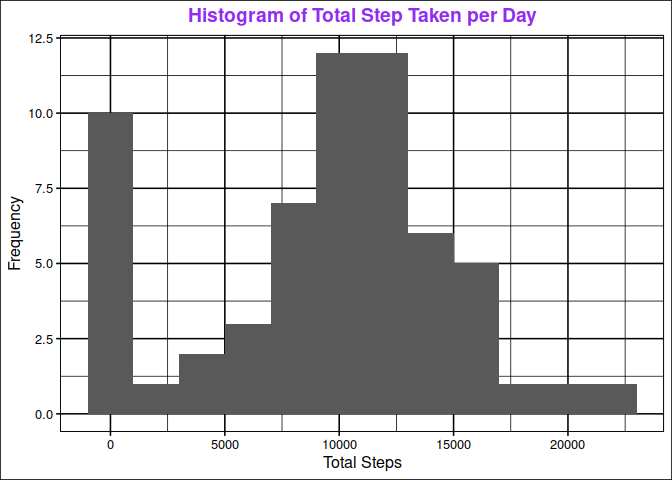
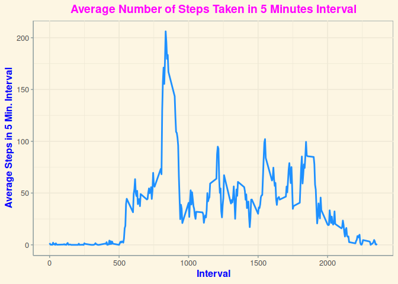
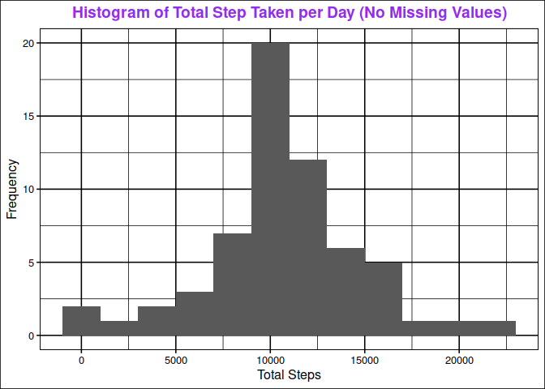
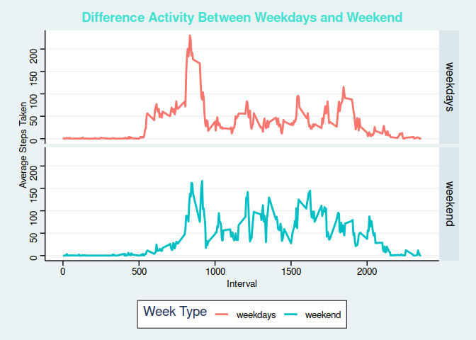

## Loading and preprocessing the data


```r
# unzip the data set
unzip("./activity.zip")

# load the data
df_activity <- read.csv("./activity.csv", stringsAsFactors = FALSE)

# transforming date into Date class and steps and interval into numeric
df_activity <- df_activity %>% 
  mutate(date = as.Date(date), steps = as.numeric(steps),
         interval = as.numeric(interval))
```

## What is mean total number of steps taken per day?


```r
# generate total steps for each day
df_activity_total <- df_activity %>% 
  group_by(date) %>% 
  summarize(total = sum(steps, na.rm = TRUE))
```

```
## `summarise()` ungrouping output (override with `.groups` argument)
```

```r
# create histogram of steps taken per day
df_activity_total %>% 
  ggplot(aes(x = total)) +
  geom_histogram(binwidth = 2000) +
  labs(x = "Total Steps",
       y = "Frequency",
       title = "Histogram of Total Step Taken per Day") +
  theme_foundation() +
  theme(plot.title = element_text(color = "purple2", hjust = .5, face = "bold"))
```

<!-- -->

```r
# calculate the mean.
mean_data <- mean(df_activity_total$total)

median_data <- median(df_activity_total$total)
```
  
  Based on the data, the mean and the median is as follow:
  
  - **mean** = **9354.23**
  
  - **median** = **10395**

## What is the average daily activity pattern?


```r
# generate average number of steps every day
df_activity_mean <- df_activity %>% 
  group_by(interval) %>% 
  summarize(avg = mean(steps, na.rm = TRUE))
```

```
## `summarise()` ungrouping output (override with `.groups` argument)
```

```r
# generate time series plot for the time interval
df_activity_mean %>% 
  ggplot(aes(interval, avg))+
  geom_line(lwd = 1, color = "dodgerblue") +
  labs(title = "Average Number of Steps Taken in 5 Minutes Interval",
       x = "Interval",
       y = "Average Steps in 5 Min. Interval") +
  theme_solarized() +
  theme(plot.title = element_text(face = "bold", colour = "magenta", hjust = .5),
        axis.title = element_text(face = "bold", color = "blue"))
```

<!-- -->

```r
# find the max average steps taken in 5 minutes interval across all the days
max <- df_activity_mean[which.max(df_activity_mean$avg),]
```
  
  On average across all the days the interval **835** is the 5 minutes interval that contains the maximum number of steps, with **206.17** of averaged steps taken.

## Imputing missing values


```r
# calculate the total number of missing values for each columns
na_data <- df_activity %>% 
  summarize(steps = sum(is.na(steps)),
            date = sum(is.na(date)),
            interval = sum(is.na(interval)))

na_data %>% 
  reactable::reactable()
```

<!--html_preserve--><div id="htmlwidget-a7daba586480ea8fc84b" class="reactable html-widget" style="width:auto;height:auto;"></div>
<script type="application/json" data-for="htmlwidget-a7daba586480ea8fc84b">{"x":{"tag":{"name":"Reactable","attribs":{"data":{"steps":[2304],"date":[0],"interval":[0]},"columns":[{"accessor":"steps","name":"steps","type":"numeric"},{"accessor":"date","name":"date","type":"numeric"},{"accessor":"interval","name":"interval","type":"numeric"}],"defaultPageSize":10,"paginationType":"numbers","showPageInfo":true,"minRows":1,"dataKey":"91079c99b4d0a67ec03a581e655ee206","key":"91079c99b4d0a67ec03a581e655ee206"},"children":[]},"class":"reactR_markup"},"evals":[],"jsHooks":[]}</script><!--/html_preserve-->
  
  From the data we know that the missing value is only on steps column with 2,304 steps.
  
  I use mean by interval approach to fill all the missing values. To make this approach possible, I will use dplyr pipeline approach. First I group the data by interval. And then use mutate function to generate another fulfilled data. To make the filling process becomes possible, I get a help from ifelse function to generate the logic. The logic is simple, if the row is not NA or not missing, then it will be as is, but if it is missing, then it will be filled using the mean of the average value in the corresponding interval. The code is as follow.
  

```r
# Create a new dataset that is equal to the original dataset with the missing data filled.
filled_data <- df_activity %>% 
  group_by(interval) %>% 
  mutate(steps = ifelse(!is.na(steps), steps, mean(steps, na.rm = TRUE))) %>% 
  ungroup()

filled_data %>% 
  summarize(steps = sum(is.na(steps)),
            date = sum(is.na(date)),
            interval = sum(is.na(interval))) %>% 
  reactable::reactable()
```

<!--html_preserve--><div id="htmlwidget-974bec5b150c9ca17b64" class="reactable html-widget" style="width:auto;height:auto;"></div>
<script type="application/json" data-for="htmlwidget-974bec5b150c9ca17b64">{"x":{"tag":{"name":"Reactable","attribs":{"data":{"steps":[0],"date":[0],"interval":[0]},"columns":[{"accessor":"steps","name":"steps","type":"numeric"},{"accessor":"date","name":"date","type":"numeric"},{"accessor":"interval","name":"interval","type":"numeric"}],"defaultPageSize":10,"paginationType":"numbers","showPageInfo":true,"minRows":1,"dataKey":"23e71acfa317cd964cca1fc17473aee9","key":"23e71acfa317cd964cca1fc17473aee9"},"children":[]},"class":"reactR_markup"},"evals":[],"jsHooks":[]}</script><!--/html_preserve-->
  
  It is clear that I have no missing values now.
  

```r
# Generate the total of the steps using data that has no missing values
df_activity_fil_total <- filled_data %>% 
  group_by(date) %>% 
  summarise(total = sum(steps))
```

```
## `summarise()` ungrouping output (override with `.groups` argument)
```

```r
df_activity_fil_total %>% 
  ggplot(aes(x = total)) +
  geom_histogram(binwidth = 2000) +
  labs(x = "Total Steps",
       y = "Frequency",
       title = "Histogram of Total Step Taken per Day (No Missing Values)") +
  theme_foundation() +
  theme(plot.title = element_text(color = "purple2", hjust = .5, face = "bold"))
```

<!-- -->

```r
mean_filled <- mean(df_activity_fil_total$total)

median_filled <- median(df_activity_fil_total$total)
```
  
  We can see that the new values of the mean is **10766.19** and the median is **10766.19**. This shows us that both data is clearly gave us different values of median and mean. In the filled data where there is no missing values it has normal distribution where the mean equals to median. This is the effect of the imputing NA value.
  
## Are there differences in activity patterns between weekdays and weekends?


```r
# compare the activity between weekdays and weekend
# by first creating the weekdays and weekend category using
# single unified data pipelines
filled_data %>% 
  mutate(week_type = as.factor(ifelse(weekdays(date) %in% c("Sabtu", "Minggu"), "weekend", "weekdays"))) %>% 
  group_by(week_type, interval) %>% 
  summarize(total = mean(steps)) %>% 
  ggplot(aes(x = interval, y = total)) +
  geom_line(aes(group = 1, col = week_type), lwd = 1) + 
  facet_grid(week_type~.) +
  labs(col = "Week Type",
       title = "Difference Activity Between Weekdays and Weekend",
       x = "Interval",
       y = "Average Steps Taken") +
  theme_stata() +
  theme(plot.title = element_text(face = "bold", colour = "turquoise"))
```

```
## `summarise()` regrouping output by 'week_type' (override with `.groups` argument)
```

<!-- -->

